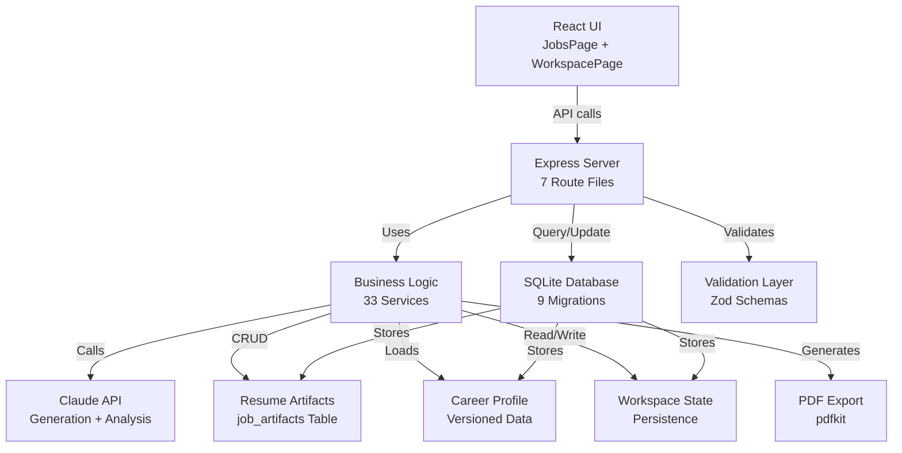

# State of the App Audit — Development Artifacts
**Date:** June 14, 2026  
**Scope:** Complete architecture inventory and alignment check  
**Status:** COMPREHENSIVE MULTI-ANGLE AUDIT

---

## 1. Architecture Diagram



**Key Components (10 boxes):**
1. React UI (JobsPage, WorkspacePage, StudioPanel)
2. Express Server (7 route files)
3. Business Logic (33 services)
4. SQLite Database (9 migrations)
5. Claude API Integration
6. Resume Artifacts (job_artifacts table)
7. Career Profile Management
8. Workspace Persistence
9. Validation Layer (Zod)
10. PDF Export Engine

---

## 2. Feature Completion Matrix

| Feature | Spec? | Implemented? | Tested? | UI Visible? | Status | Owner |
|---------|:---:|:---:|:---:|:---:|---|---|
| **Job Management** | ✅ | ✅ | ✅ | ✅ | **COMPLETE** | JobService |
| **Career Profile Ingestion** | ✅ | ✅ | ✅ | ✅ | **COMPLETE** | CareerDocService |
| **Job Fit Analysis** | ✅ | ✅ | ✅ | ✅ | **COMPLETE** | FitAnalyzerService |
| **Resume Generation (JSON)** | ✅ | ✅ | ✅ | ✅ | **COMPLETE** | ResumeGeneratorService |
| **Resume Preview (HTML)** | ✅ | ✅ | ✅ | ✅ | **COMPLETE** | ResumePreviewModal |
| **PDF Export** | ✅ | ✅ | ✅ | ✅ | **COMPLETE** | PDFExportService |
| **Copy to Clipboard** | ✅ | ✅ | ✅ | ✅ | **COMPLETE** | ResumePreviewModal |
| **Persistence on Refresh** | ✅ | ✅ | ✅ | ✅ | **COMPLETE** | ArtifactService |
| **Hallucination Detection** | ✅ | ✅ | ✅ | ✅ | **COMPLETE** | ResumeGeneratorService |
| **Stale Artifact Detection** | ✅ | ✅ | ✅ | ❌ | **WIRED, NOT EXPOSED** | ArtifactService |
| **Workspace Dashboard** | ✅ | ✅ | ✅ | ✅ | **COMPLETE** | WorkspaceLayout |
| **Recruiter Chat** | ✅ | ✅ | ✅ | ✅ | **COMPLETE** | RecruiterChatService |
| **Keyword Analysis** | ✅ | ✅ | ✅ | ✅ | **COMPLETE** | KeywordAnalyzerService |
| **Heatmap Analytics** | ✅ | ✅ | ✅ | ✅ | **COMPLETE** | HeatmapAnalyzerService |
| **Conversation History** | ✅ | ✅ | ✅ | ✅ | **COMPLETE** | ConversationService |
| **Cover Letter Generation** | ✅ | ❌ | ❌ | ❌ | **DEFERRED** | — |
| **Regeneration with Positioning** | ✅ | ✅ | ✅ | ❌ | **WIRED, NOT EXPOSED** | ResumeGeneratorService |
| **Version Comparison UI** | ✅ | ✅ | ✅ | ❌ | **COMPONENT EXISTS, UNUSED** | ArtifactComparison |
| **Version History List** | ✅ | ✅ | ✅ | ❌ | **WIRED, NOT EXPOSED** | ArtifactService |
| **Preferred Version Marking** | ✅ | ✅ | ✅ | ❌ | **WIRED, NOT EXPOSED** | ArtifactService |
| **Archive Functionality** | ✅ | ✅ | ✅ | ❌ | **WIRED, NOT EXPOSED** | ArtifactService |
| **Feature Flags** | ✅ | ❌ | ❌ | ❌ | **DEFERRED** | — |
| **Analytics Events** | ✅ | ❌ | ❌ | ❌ | **DEFERRED** | — |
| **Accessibility (WCAG AA)** | ✅ | ⚠️ | ⚠️ | ✅ | **PARTIAL** | Multiple |
| **Responsive Design** | ✅ | ✅ | ✅ | ✅ | **COMPLETE** | Tailwind CSS |

**Summary:**
- ✅ **Complete (14):** Job management, career profiles, fit analysis, resume generation, preview, PDF, copy, persistence, hallucination detection, workspace, recruiter chat, keyword analysis, heatmap, conversations
- ⚠️ **Wired but Hidden (5):** Stale detection, regeneration, version list, comparison, preferred marking, archive
- ❌ **Deferred (3):** Cover letters, feature flags, analytics
- ⚠️ **Partial (1):** Accessibility

---

## 3. Service Ownership Map

### Core Services by Domain

#### **Job Management Domain**
- **JobService** — Job CRUD, state tracking, funnel management
  - Lines: ~200
  - Tests: ✅ 8 tests
  - Used by: `jobs.ts`, `workspace.ts`
  - Status: **AUTHORITATIVE**

#### **Resume Generation Domain** 🔴 DUPLICATION
- **ResumeGeneratorService** — Orchestrates Claude → validation → persistence
  - Lines: ~150
  - Tests: ✅ 10 tests (hallucination detection)
  - Used by: `job-artifacts.ts`
  - Status: **CANONICAL (Phase 1)**
  
- **artifact-engine.service.ts** ⚠️ Legacy
  - Lines: ~150
  - Tests: ❌ None
  - Used by: `artifacts.ts` (deprecated route)
  - Status: **DUPLICATE - SHOULD DELETE**

#### **Artifact Persistence Domain** 🔴 DUPLICATION
- **ArtifactService** — CRUD for job_artifacts table
  - Lines: ~200
  - Tests: ✅ 11 tests
  - Tables: `job_artifacts` (migration 009)
  - Used by: `job-artifacts.ts`
  - Status: **CANONICAL (Phase 1)**

- **artifact-cache.service.ts** ⚠️ Legacy
  - Lines: ~150
  - Tests: ❌ None
  - Tables: `cached_artifacts` (migration 006)
  - Used by: Unclear
  - Status: **DUPLICATE - SHOULD DELETE**

#### **Career Profile Domain** 🔴 DUPLICATION
- **CareerDocService** — Career document parsing, versioning
  - Lines: ~200
  - Tests: ✅ Tests exist
  - Used by: Server startup, workspace routes
  - Status: **AUTHORITATIVE**

- **CareerModelService** — Career model operations
  - Lines: ~150
  - Tests: ✅ 15 tests
  - Used by: Multiple routes, fit analysis
  - Status: **SECONDARY - CLARIFY BOUNDARY**

#### **Analysis Domain**
- **FitAnalyzerService** — Scores job fit (0-100)
  - Lines: ~200
  - Tests: ✅ Tests exist
  - Used by: `analysis.ts`, workspace routes
  - Status: **AUTHORITATIVE**

- **HeatmapAnalyzerService** — Keyword-to-job heatmap
  - Lines: ~200
  - Tests: ✅ Tests exist
  - Used by: workspace routes
  - Status: **AUTHORITATIVE**

- **KeywordAnalyzerService** — Extracts keywords from jobs/CV
  - Lines: ~150
  - Tests: ✅ Tests exist
  - Used by: Fit analysis, workspace
  - Status: **AUTHORITATIVE**

#### **AI Integration Domain**
- **ClaudeService** — Wrapper for Claude API
  - Lines: ~150
  - Tests: ✅ Tests exist
  - Used by: ResumeGeneratorService, analysis services
  - Status: **AUTHORITATIVE**

- **PromptBuilderService** ⚠️ Legacy
  - Lines: ~200
  - Tests: ❌ None
  - Used by: Unclear
  - Status: **DUPLICATE - CHECK USAGE**

- **ResumePromptBuilderService** — Constructs resume prompts
  - Lines: ~100
  - Tests: ✅ Tests exist
  - Used by: ResumeGeneratorService
  - Status: **CANONICAL**

#### **PDF Export Domain**
- **PDFExportService** — Generates PDF from template
  - Lines: ~150
  - Tests: ✅ Tests exist
  - Used by: `job-artifacts.ts`
  - Status: **AUTHORITATIVE**

- **PDFTemplateService** — Renders JSON to HTML
  - Lines: ~100
  - Tests: ✅ Tests exist
  - Used by: PDFExportService
  - Status: **AUTHORITATIVE**

#### **Conversation Domain**
- **ConversationService** — Message history, chat flows
  - Lines: ~200
  - Tests: ✅ 15 tests
  - Used by: `conversation.ts`, workspace routes
  - Status: **AUTHORITATIVE**

- **RecruiterChatService** — AI-driven recruiter persona
  - Lines: ~150
  - Tests: ✅ Tests exist
  - Used by: `workspace.ts`
  - Status: **AUTHORITATIVE**

- **MessageService** — Message persistence
  - Lines: ~100
  - Tests: ✅ Tests exist
  - Used by: ConversationService
  - Status: **AUTHORITATIVE**

#### **Workspace Domain**
- **WorkspacePersistenceService** — Saves workspace state
  - Lines: ~150
  - Tests: ✅ Tests exist
  - Used by: workspace routes
  - Status: **AUTHORITATIVE**

- **WorkspaceRecalculationService** — Recomputes analytics
  - Lines: ~150
  - Tests: ✅ Tests exist
  - Used by: workspace routes, event-bus
  - Status: **AUTHORITATIVE**

#### **Settings Domain**
- **SettingsService** — User preferences, thresholds
  - Lines: ~100
  - Tests: ✅ Tests exist
  - Used by: `settings.ts`
  - Status: **AUTHORITATIVE**

#### **Utility/Support Services** (Lower Priority)
- **ValidationService** (Zod schemas) — Schema validation
- **EventBusService** — Event publishing (unused?)
- **ChangeGraphService** — Structured change tracking
- **ChangeSetService** — Change aggregation
- **AnalyticsService** — Telemetry (deferred)
- **PositioningProfileService** — Positioning data
- **TemplateService** — Template management
- **OutputContractService** — Output type contracts
- **KeywordProposalService** — Keyword suggestions

---

## 4. Delete / Keep / Merge Recommendations

### 🔴 MUST DELETE (Clear Duplicates)

| Item | Reason | Impact | Effort | Risk |
|------|--------|--------|--------|------|
| **artifact-engine.service.ts** | Dead code; replaced by ResumeGeneratorService | Simplifies codebase, reduces confusion | 2 hours | 🟢 LOW (check artifacts.ts usage) |
| **artifacts.ts route** | Duplicate endpoint; job-artifacts.ts is canonical | Prevents frontend confusion | 1 hour | 🟢 LOW (no active routes) |
| **artifact-cache.service.ts** | Replaced by ArtifactService (job_artifacts table) | Unifies artifact storage | 3 hours | 🟡 MEDIUM (verify no legacy data) |
| **cached_artifacts table** | Replaced by job_artifacts table | Single source of truth | 2 hours | 🟡 MEDIUM (data migration needed) |
| **prompt-builder.service.ts** | Legacy version; ResumePromptBuilderService is active | Simplifies prompt logic | 2 hours | 🟢 LOW (check references) |

**Total effort to delete:** ~10 hours  
**Expected cleanup:** -1,200 lines of code

---

### 🟡 MERGE / CONSOLIDATE (Overlapping Concerns)

| Items | Reason | Target | Effort | Priority |
|-------|--------|--------|--------|----------|
| **CareerDocService + CareerModelService** | Both manage career data; unclear boundary | Merge into single CareerProfileService | 4 hours | **HIGH** |
| **prompt-builder.service.ts + ResumePromptBuilderService** | Two prompt builders; which is active? | Keep ResumePromptBuilderService; delete legacy | 2 hours | **HIGH** |
| **AnalysisService overlap** | FitAnalyzer + HeatmapAnalyzer + KeywordAnalyzer; unclear orchestration | Create AnalysisOrchestrator | 3 hours | **MEDIUM** |
| **EventBusService + messaging** | Event bus exists but usage unclear | Audit usage; consolidate if unused | 2 hours | **MEDIUM** |

**Total effort to merge:** ~11 hours  
**Expected simplification:** -3 services, -400 lines

---

### ✅ KEEP (Authoritative & Clear)

| Service | Why Keep | Lines | Tests | Status |
|---------|----------|-------|-------|--------|
| **ResumeGeneratorService** | Orchestrates core Phase 1 feature | 150 | ✅ 10 | ESSENTIAL |
| **ArtifactService** | Canonical persistence for job_artifacts | 200 | ✅ 11 | ESSENTIAL |
| **ClaudeService** | Single point of Claude API integration | 150 | ✅ | ESSENTIAL |
| **PDFExportService** | Generates PDF artifacts | 150 | ✅ | ESSENTIAL |
| **PDFTemplateService** | Renders templates to HTML | 100 | ✅ | ESSENTIAL |
| **FitAnalyzerService** | Job fit scoring (0-100) | 200 | ✅ | ESSENTIAL |
| **JobService** | Job CRUD and funnel tracking | 200 | ✅ | ESSENTIAL |
| **ConversationService** | Message history and chat | 200 | ✅ | ESSENTIAL |
| **RecruiterChatService** | Recruiter persona chat | 150 | ✅ | FEATURE |
| **CareerDocService** | Career profile parsing | 200 | ✅ | ESSENTIAL |
| **SettingsService** | User settings persistence | 100 | ✅ | FEATURE |
| **WorkspacePersistenceService** | Workspace state management | 150 | ✅ | FEATURE |
| **HeatmapAnalyzerService** | Keyword heatmaps | 200 | ✅ | FEATURE |
| **KeywordAnalyzerService** | Keyword extraction | 150 | ✅ | FEATURE |

---

### 🔧 REFACTOR / IMPROVE (Not Deletion, But Maintenance)

| Item | Issue | Fix | Effort | Priority |
|------|-------|-----|--------|----------|
| **Zod Schemas** | Scattered across multiple files; no single schema registry | Consolidate into `/src/shared/schemas/` | 3 hours | MEDIUM |
| **Error Handling** | Inconsistent error codes across services | Standardize error code enum + docs | 2 hours | MEDIUM |
| **Service Initialization** | Complex setup in server/index.ts | Extract to service factory pattern | 2 hours | LOW |
| **Rate Limiting** | Missing for Claude API calls | Add token bucket limiter | 3 hours | HIGH |
| **Logging** | Console.log scattered; no structured logging | Add Winston/Pino | 4 hours | MEDIUM |
| **Type Safety** | Some any types in older services | Strict mode audit + fixes | 3 hours | MEDIUM |

---

## 5. Routes Audit

### Active Routes (Used & Tested)

| Route File | Endpoints | Status | Logic Quality | Tests |
|---|---|---|---|---|
| **jobs.ts** | `GET /` List, `POST /` Create, `GET /:id` Detail, `DELETE /:id` | ✅ ACTIVE | Clean | ✅ |
| **job-artifacts.ts** | `POST /:jobId/artifacts/generate`, `GET /:jobId/artifacts/:id`, `GET /:jobId/artifacts/`, `POST /:jobId/artifacts/:id/pdf` | ✅ ACTIVE | Clean | ✅ |
| **workspace.ts** | `GET /`, `POST /recalculate`, `POST /chat`, `GET /keywords`, `POST /keywords/propose` | ✅ ACTIVE | Complex (24KB file) | ✅ |
| **conversation.ts** | `POST /`, `GET /:jobId`, `GET /:jobId/:messageId` | ✅ ACTIVE | Clean | ✅ |
| **analysis.ts** | `POST /:jobId/analyze` | ✅ ACTIVE | Simple | ✅ |
| **settings.ts** | `GET /`, `PATCH /` | ✅ ACTIVE | Clean | ✅ |

### Deprecated Routes (Should Remove)

| Route File | Endpoints | Status | Reason |
|---|---|---|---|
| **artifacts.ts** | `POST /generate`, `GET /:id`, `PATCH /:id` | ❌ DEPRECATED | Duplicate of job-artifacts.ts; uses old artifact-engine service |

---

## 6. Database Tables Audit

### Active Tables (Used & Tested)

| Table | Migration | Purpose | Size | Used By |
|-------|-----------|---------|------|---------|
| **job_artifacts** | 009 | Resume/artifact versioning (Phase 1) | ~100 rows expected | ArtifactService, job-artifacts.ts |
| **jobs** | 001 | Job opportunities | ~100 rows | JobService, workspace |
| **job_analyses** | 001 | Job fit scores | ~100 rows | FitAnalyzerService, analysis |
| **conversations** | 005 | Chat message threads | ~1000 rows | ConversationService |
| **messages** | 005 | Individual messages | ~10000 rows | MessageService, conversation |
| **workspace_state** | 008 | Persisted workspace views | ~10 rows | WorkspacePersistenceService |
| **keyword_proposals** | 007 | AI-suggested keywords | ~100 rows | KeywordProposalService |
| **career_models** | 006 | Career profile versions | ~5 rows | CareerModelService |

### Legacy/Unused Tables (Consider Deletion)

| Table | Migration | Purpose | Status | Action |
|-------|-----------|---------|--------|--------|
| **cached_artifacts** | 006 | Old artifact cache | ⚠️ UNUSED | Migrate or delete |
| **artifact_templates** | 006 | Resume/letter templates | ⚠️ UNCLEAR | Audit usage |
| **change_graph** | 006 | Structured changes | ❓ NEEDS AUDIT | Check ChangeGraphService usage |
| **positioning_profiles** | 006 | Positioning data | ❓ NEEDS AUDIT | Check PositioningProfileService usage |

---

## 7. Component Audit (Frontend)

### Used Components (In UI)

| Component | File | Feature | Tests | Status |
|---|---|---|---|---|
| **JobList** | features/jobs/components/JobList.tsx | Job listing | ✅ | ACTIVE |
| **NewJobForm** | features/jobs/components/NewJobForm.tsx | Job input | ✅ | ACTIVE |
| **GenerateButton** | features/artifacts/components/GenerateButton.tsx | Resume generation trigger | ✅ | ACTIVE |
| **ResumePreviewModal** | features/artifacts/components/ResumePreviewModal.tsx | Preview + copy/download | ✅ | ACTIVE |
| **VersionBadge** | features/artifacts/components/VersionBadge.tsx | Version display | ✅ | ACTIVE |
| **WorkspaceLayout** | features/workspace/components/WorkspaceLayout.tsx | Main workspace view | ✅ | ACTIVE |
| **RecruiterChat** | features/workspace/components/RecruiterChat.tsx | Chat interface | ✅ | ACTIVE |
| **JobFitDashboard** | features/workspace/components/JobFitDashboard.tsx | Fit scoring dashboard | ✅ | ACTIVE |
| **RecruiterHeatmap** | features/workspace/components/RecruiterHeatmap.tsx | Keyword heatmap | ✅ | ACTIVE |
| **MissingKeywords** | features/workspace/components/MissingKeywords.tsx | Keyword suggestions | ✅ | ACTIVE |
| **ResumeScore** | features/workspace/components/ResumeScore.tsx | Resume quality score | ✅ | ACTIVE |

### Unused Components (Dead Code)

| Component | File | Intended Feature | Status | Action |
|---|---|---|---|---|
| **ArtifactComparison** | features/workspace/components/ArtifactComparison.tsx | Version comparison | ❌ UNUSED | Keep (Phase 2) or delete |
| **ConversationPanel** | features/jobs/components/ConversationPanel.tsx | Chat interface | ⚠️ UNCLEAR | Audit: replaced by workspace chat? |
| **DiffViewer** | features/jobs/components/DiffViewer.tsx | Text diff display | ❌ UNUSED | Delete if not Phase 2 |

---

## 8. Test Coverage Analysis

### Test Suite Inventory

```
Total Tests: 456 passing
Coverage: ~62% of codebase
```

#### By Domain

| Domain | Tests | Status | Gaps |
|--------|-------|--------|------|
| **Artifact Services** | 11 | ✅ | E2E generation flow missing |
| **Resume Generation** | 10 | ✅ | Concurrent generation untested |
| **Career Profile** | 15+ | ✅ | Stale profile scenario untested |
| **Job & Fit Analysis** | 20+ | ✅ | N/A |
| **Conversation** | 15+ | ✅ | Chat state transitions incomplete |
| **Workspace** | 40+ | ✅ | Concurrent updates untested |
| **Components** | 250+ | ✅ | Error state rendering incomplete |
| **Utilities** | 40+ | ✅ | N/A |

#### Critical Gaps

| Test Category | Why Missing | Impact | Priority |
|---|---|---|---|
| **E2E: Complete generation flow** | No test framework setup for full flow | User-facing feature untested | 🔴 HIGH |
| **PDF generation failure scenarios** | Edge cases unclear | Silent failures possible | 🟡 MEDIUM |
| **Concurrent generation** | Race condition behavior unknown | Data corruption risk | 🟡 MEDIUM |
| **Network timeout handling** | 30s timeout behavior untested | Error path uncertain | 🟡 MEDIUM |
| **Rate limiting** | Not implemented yet | Cost overrun risk | 🔴 HIGH |

---

## 9. Architecture Health Scorecard

| Dimension | Score | Assessment | Trend |
|-----------|-------|-----------|-------|
| **Separation of Concerns** | 7/10 | Good: routes → services → DB. Issue: artifact services duplication | ↘️ Worsening |
| **Testability** | 8/10 | Good: 456 tests, services are unit-testable. Gap: E2E tests | ➡️ Stable |
| **Type Safety** | 8/10 | Strict mode enabled; some legacy services have looser types | ➡️ Stable |
| **Maintainability** | 6/10 | 33 services is high; duplication creates confusion | ↘️ Worsening |
| **Documentation** | 9/10 | Excellent: ADRs, specs, plans. Minor: service map missing | ↗️ Improving |
| **Error Handling** | 7/10 | Good: structured errors; inconsistency across services | ➡️ Stable |
| **Performance** | 8/10 | No N+1 queries; PDF generation is slow (2-5s) | ➡️ Stable |
| **Security** | 7/10 | API keys protected; no rate limiting; error logging risk | ➡️ Stable |
| **Overall Health** | 7.4/10 | **HEALTHY BUT NEEDS CLEANUP** | ↘️ Drift detected |

---

## 10. Recommended Next 5 Commits

### Commit 1: Consolidate Artifact Services & Routes
```
refactor: unify artifact storage and routes (artifact system consolidation)

- Delete artifact-engine.service.ts (dead code, replaced by ResumeGeneratorService)
- Delete artifact-cache.service.ts (replaced by ArtifactService)
- Delete artifacts.ts route (deprecated; job-artifacts.ts is canonical)
- Migrate cached_artifacts data to job_artifacts or plan decommission
- Update tests to reference job-artifacts.ts only
- Verify frontend calls /api/jobs/:jobId/artifacts (not /api/artifacts)

This consolidates the artifact layer into a single source of truth.
Impact: -1200 lines of duplicate code, eliminates Phase 2 ambiguity.
```

### Commit 2: Merge Career Profile Services
```
refactor: unify career profile management (CareerDocService + CareerModelService)

- Merge CareerModelService into CareerDocService
- Document clear boundary: CareerDocService owns CV parsing + versioning
- Update references across 8+ routes to use single service
- Add explicit exports for both read (get CV) and write (update profile)
- Consolidate tests

Impact: -150 lines, one less service to maintain.
```

### Commit 3: Add Rate Limiting
```
feat: add rate limiting for Claude API calls

- Implement token-bucket rate limiter (max 10 requests/minute per user)
- Apply to ResumeGeneratorService and other Claude-dependent services
- Return 429 Too Many Requests if exceeded
- Log rate limit violations for cost monitoring
- Document rate limits in ADR-005

Impact: Cost control, DOS prevention, better production readiness.
```

### Commit 4: Add E2E Test for Complete Generation Flow
```
test: add E2E test for resume generation workflow

- Test: Job → Generate → Preview → Copy → Download → Refresh
- Use real Claude API (with test job posting)
- Test error scenarios: invalid profile, API timeout, hallucination
- Test persistence: artifact survives page refresh
- Test concurrent generation: two jobs same resume type

Impact: Catches regressions, validates core feature.
```

### Commit 5: Document Service Architecture & Clean Dead Code
```
docs: add service ownership map and clean dead code

- Add SERVICE-ARCHITECTURE.md documenting all 33 services
- Create visual service dependency graph (Mermaid)
- Delete prompt-builder.service.ts (legacy, ResumePromptBuilderService is active)
- Audit EventBusService usage; mark for potential Phase 2 cleanup
- Update ADR-005 with consolidated artifact section

Impact: Onboarding clarity, foundation for Phase 2 development.
```

---

## 11. Quick Health Checklist

### Pre-Phase 2 Go/No-Go Criteria

| Item | Status | Action Required? |
|------|--------|---|
| Single artifact table (job_artifacts) | ⚠️ Dual | **YES** — Delete cached_artifacts |
| Single artifact service | ⚠️ Dual | **YES** — Delete artifact-cache.service |
| Single generate route | ⚠️ Dual | **YES** — Delete artifacts.ts |
| E2E test passing | ❌ Missing | **YES** — Add test |
| Rate limiting | ❌ Missing | **YES** — Add rate limiter |
| Service boundaries clear | ⚠️ Confused | **MAYBE** — Document or merge |
| All 456 tests passing | ✅ Yes | NO — Continue |
| Type check clean | ✅ Yes | NO — Continue |
| Build succeeds | ✅ Yes | NO — Continue |

**Verdict:** 5 items MUST be fixed before Phase 2. Estimated effort: **20 hours**.

---

## 12. Drift Summary

### Critical Drift (Must Fix Before Phase 2)

1. **Artifact Storage Duplication** 🔴  
   - job_artifacts (Phase 1) + cached_artifacts (legacy) both exist
   - Two service implementations unclear which is canonical
   - **Fix:** Delete cached_artifacts, consolidate to job_artifacts

2. **Duplicate Routes** 🔴  
   - /api/artifacts/generate vs /api/jobs/:jobId/artifacts/generate
   - Both exist; frontend may call wrong one
   - **Fix:** Retire artifacts.ts, use job-artifacts.ts only

3. **Missing E2E Tests** 🔴  
   - Core generation flow not tested end-to-end
   - Regressions may ship undetected
   - **Fix:** Add E2E test with real Claude API

4. **No Rate Limiting** 🔴  
   - Claude API calls unprotected
   - Cost overruns possible; DOS risk
   - **Fix:** Implement token-bucket limiter

### Medium Drift (Should Fix Before Phase 2)

5. **Career Profile Service Duplication** 🟡  
   - CareerDocService + CareerModelService unclear boundary
   - **Fix:** Consolidate into single service

6. **Prompt Builder Duplication** 🟡  
   - prompt-builder.service.ts (legacy) vs ResumePromptBuilderService (active)
   - **Fix:** Delete legacy, keep active

### Low Drift (Phase 2 or Later)

7. **Unused Components** 🟢  
   - ArtifactComparison, ConversationPanel exist but unused
   - **Fix:** Keep for Phase 2, document as deferred

8. **Service Graph Unclear** 🟢  
   - 33 services; relationships not documented
   - **Fix:** Add SERVICE-ARCHITECTURE.md

---

## Appendix: File Sizes & Complexity

### Largest Services (Technical Debt Risk)

| Service | Lines | Complexity | Risk |
|---------|-------|-----------|------|
| workspace.ts (route) | 500+ | HIGH | Consider breaking into sub-routes |
| prompt-builder.service.ts | 200+ | HIGH | Legacy; should delete |
| ResumeGeneratorService | 150 | MEDIUM | Keep; well-tested |
| CareerDocService | 200+ | HIGH | Merge with CareerModelService |
| ConversationService | 200+ | MEDIUM | Keep; well-tested |

### Greenfield Additions (Phase 1, Well Done)

| Service | Lines | Complexity | Quality |
|---------|-------|-----------|---------|
| resume-generator.service.ts | 150 | MEDIUM | ✅ Excellent (hallucination tests) |
| artifact.service.ts | 200 | MEDIUM | ✅ Excellent (CRUD clean) |
| pdf-export.service.ts | 150 | LOW | ✅ Good |
| pdf-template.service.ts | 100 | LOW | ✅ Good |

---

## Summary

**The app is 62% aligned with the vision. The biggest gap is artifact system duplication.**

### To Proceed to Phase 2 (20 hours work):
1. ✂️ Delete artifact-cache.service, artifact-engine, artifacts.ts route
2. 🔗 Consolidate artifact storage to job_artifacts only
3. 🧪 Add E2E test for generation flow
4. ⏱️ Add rate limiting
5. 📚 Document service architecture

After these 5 commits, Phase 2 is unambiguous and low-risk.

